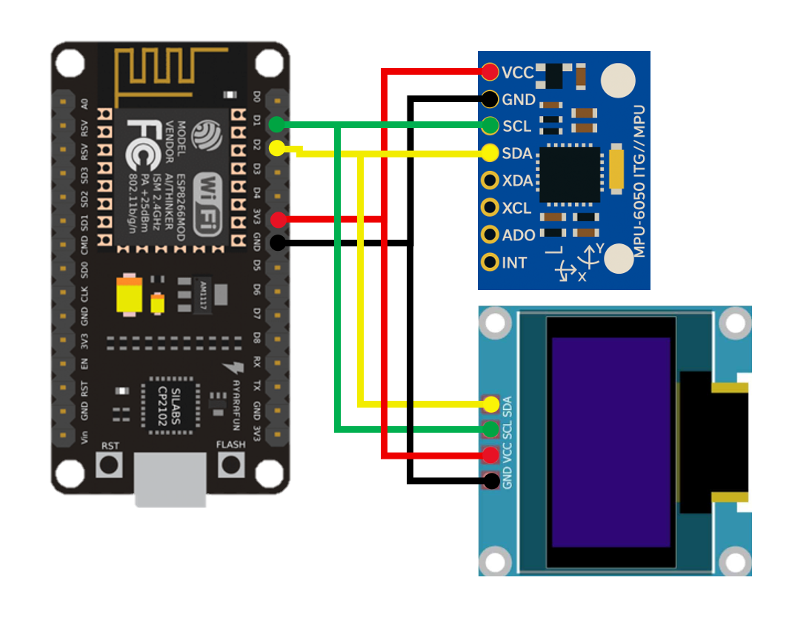
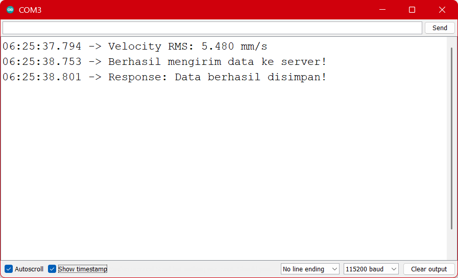
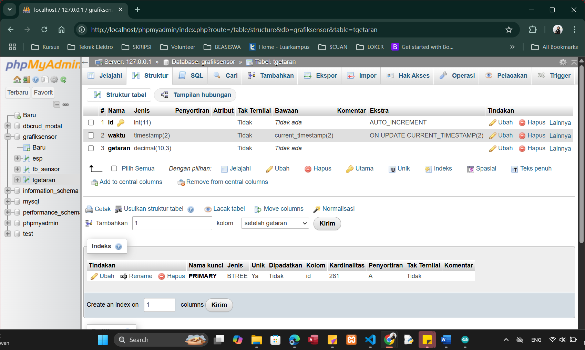
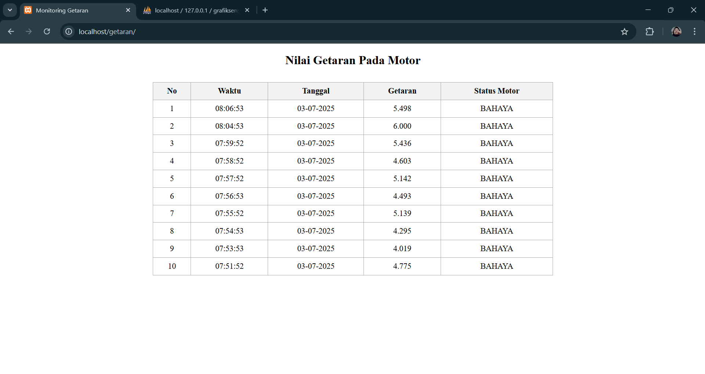
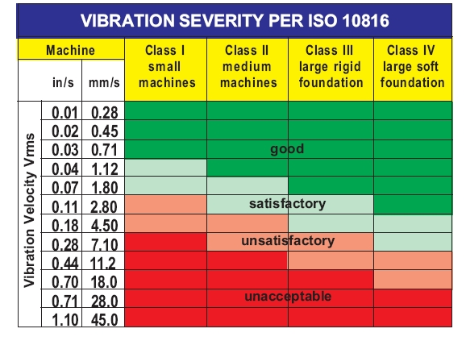

## Hi Everyone ╰(*°▽°*)╯🍉

Kita akan belajar menggunakan sensor MPU6050 dengan NodeMCU ESP8266 sebagai alat detektor getaran yang dapat diaplikasikan pada motor induksi di rumahmu. Ini berfungsi untuk mengetahui apakah motor induksi yang kalian miliki masih bagus atau bahkan sudah dalam kondisi abnormal dan butuh perawatan. Cara ini efektif dan mudah digunakan untuk kalian di rumah. Selamat mencoba 🥐.

Berikut langkah-langkah yang bisa kalian ikuti:
1. **Persiapkan alat dan bahan**:  
    - NodeMCU ESP8266  
    - Sensor MPU6050  
    - Kabel jumper  
    - OLED 0,96 inci  
    - Breadboard (opsional)  
    - Software Arduino IDE

2. **Rangkaian**:  
    - Hubungkan sensor MPU6050 ke NodeMCU ESP8266 sesuai dengan pin I2C (SDA ke D2, SCL ke D1, VCC ke 3.3V, GND ke GND).
    - Jika menggunakan OLED 0,96 inci, hubungkan ke NodeMCU ESP8266 sesuai dengan pin I2C (VCC ke 3.3V, GND ke GND, SDA ke D2, SCL ke D1).
    

3. **Upload Program**:  
    - Gunakan Arduino IDE untuk mengunggah kode program pembacaan data getaran dari MPU6050 ke NodeMCU.
    - Unggah kode program ekstensi .ino pada folder Arduino IDE Code.

4. **Monitoring Data**:  
    - Buka Serial Monitor pada Arduino IDE untuk melihat data getaran yang terbaca dari sensor.  
    
    - Jika Anda menggunakan Webserver, siapkan database Anda di MySQL dengan membuat tabel baru bernama "tgetaran" dan membuat kolom baru seperti pada gambar di bawah ini:  
    
    Ada 3 kolom yang dapat digunakan untuk menyimpan data, yaitu: Id, Waktu, Getaran.
    Berikut contoh tampilan web sederhana yang berhasil menampilkan data dari database.  
    

5. **Analisis**:  
    Amati perubahan data getaran. Jika nilai getaran di luar batas normal berdasarkan standar ISO 10816, berarti motor induksi perlu dicek atau dirawat.  
    

Semoga berhasil! Jika ada pertanyaan, silakan tinggalkan komentar. 🚀
